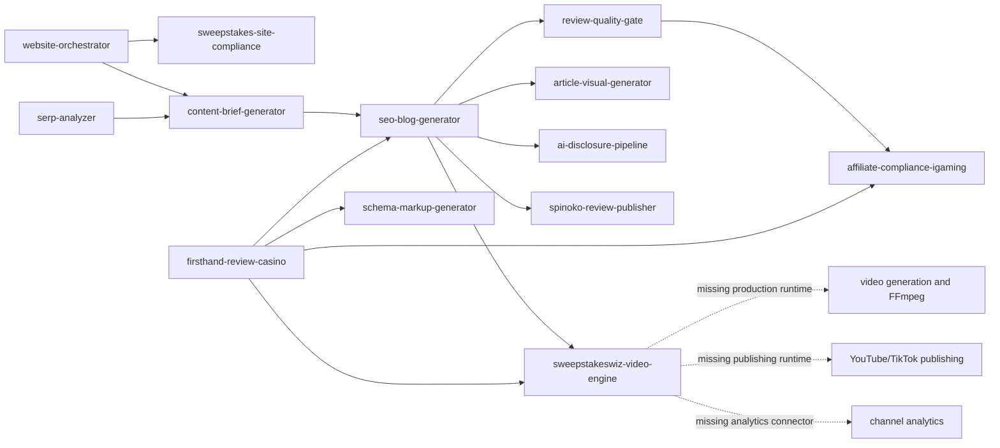

# AI Brain Skill Integration Audit

Date: 2026-07-14  
Source of truth: private repository `madrank8/ai-brain`, branch `main`, commit `21c01b08e4a84e8e0223d1de05ed275c55158627`

## Executive summary

The AI Brain collection is already strong at strategy, SEO planning, compliance guidance, content generation, and scoring. Its main weakness is execution integrity: several skills describe deterministic pipelines whose referenced scripts or reference files do not exist, and several downstream capabilities depend on MCPs, APIs, or publishing tools that are not guaranteed to be available.

The first repair target should be `firsthand-review-casino`. It is central to the site's defensible first-hand evidence strategy, but all five of its promised reference files and all three of its promised scripts are absent. Until those resources exist and are tested, the skill is a detailed specification rather than an executable evidence pipeline.

Do not install third-party skills yet. The internal stack covers most reasoning needs. External candidates are useful mainly for video rendering, publishing, analytics, and media processing, and each requires a code, privacy, license, and credential review.

## Verified inventory

| Check | Result |
|---|---:|
| AI Brain skill directories | 76 |
| Valid `SKILL.md` name/description and folder naming | 76/76 |
| Claude copies matching the private repository | 76/76 |
| Skills connected to Codex | 76/76 |
| Broken Codex symlinks | 0 |
| Skills with `agents/openai.yaml` | 1/76 |
| Skills containing a `README.md` | 76/76 |
| Referenced resource files/scripts not found | 23 |

The repository and installed Claude copies match by content. The only raw directory difference was Python `__pycache__` output under `last30days`, which is not skill source.

## Sweepstakes capability graph

## Existing strengths

| Layer | Primary owner | Assessment |
|---|---|---|
| Whole-site planning | `website-orchestrator` | Strong orchestration structure with five real reference files and explicit phase gates. |
| Site legal/trust infrastructure | `sweepstakes-site-compliance` | Clear separation from content-level compliance; four reference files exist. |
| Content-level iGaming compliance | `affiliate-compliance-igaming` | Appropriate owner for wording, disclosures, state restrictions, and responsible-gaming checks. |
| SERP research and briefing | `serp-analyzer` -> `content-brief-generator` | Clear handoff, but runtime depends on external Ahrefs/Tavily capabilities. |
| Long-form production | `seo-blog-generator` | Broad and deeply integrated, but oversized at 926 lines and at risk of becoming the universal owner of too many stages. |
| First-hand evidence | `firsthand-review-casino` | Excellent specification and compliance boundary; currently non-executable because all promised resources are absent. |
| Review go/no-go gate | `review-quality-gate` | Good separation between evidence gathering and publishing judgment; one batch script exists. |
| Schema | `schema-markup-generator` | Appropriate centralized owner; seven reference files exist. |
| AI disclosure | `ai-disclosure-pipeline` | Compact, focused, and well integrated; six reference files exist. |
| CMS publishing | `spinoko-review-publisher` | Most operationally mature downstream skill: four references and six scripts. |
| Video strategy | `sweepstakeswiz-video-engine` | Strong strategy, scripting, compliance, and diagnosis; no actual rendering/publishing scripts. |

## Confirmed gaps and risks

### P0 - `firsthand-review-casino` cannot execute its promised workflow

Missing resources:

- `references/capture-protocol.md`
- `references/compliance-requirements.md`
- `references/caption-patterns.md`
- `references/schema-output.md`
- `references/review-structure.md`
- `scripts/redact_pii.py`
- `scripts/extract_exif.py`
- `scripts/generate_manifest.py`

Impact:

- No deterministic OCR/PII redaction exists.
- No tested evidence manifest exists.
- The skill cannot safely guarantee that only redacted screenshots reach publishing output.
- The most important first-hand evidence workflow depends on improvisation.

Repair:

1. Extract the five reference files from the current 237-line specification.
2. Implement local OCR plus irreversible redaction; do not send casino screenshots containing PII to an external API by default.
3. Implement EXIF extraction and evidence-manifest generation.
4. Add fixture screenshots containing synthetic email, phone, address, DOB, username, card fragments, and balance values.
5. Test false negatives, false positives, output isolation, audit completeness, and recovery resistance.

### P0 - hard-coded identity and environment assumptions

`firsthand-review-casino` hard-codes `#niro-halevy` as the author entity while this repository currently presents Ilija Milosevic as the editorial byline. It also assumes Claude-specific paths such as `/mnt/user-data/outputs/` and `/home/claude`.

Repair:

- Make author `@id`, target property, output root, and platform runtime explicit configuration inputs.
- Refuse schema generation when the configured Person `@id` cannot be found in the target site's entity graph.
- Use the active workspace/output directory instead of fixed Claude paths.

### P1 - 23 missing resources across the repository

Besides the eight missing `firsthand-review-casino` resources, missing resources occur in:

- `affiliate-compliance-forex`: seven missing references/scripts
- `authority-amplifier-pro`: one missing audit rubric
- `spinoko-geo`: two missing references
- `ugc-app-launch-playbook`: five missing references

Repair these before treating the affected modes as executable. A CI check should fail whenever a `SKILL.md` references a local `references/`, `scripts/`, or `assets/` path that does not exist.

### P1 - runtime dependencies are described but not guaranteed

Important paths require capabilities outside the skill bundle:

- `serp-analyzer`: Ahrefs MCP
- `tavily-retrieval`: Tavily credentials/tooling
- `sweepstakeswiz-video-engine`: DataForSEO for topic automation
- `article-visual-generator`: Gemini/Imagen credentials
- video execution: Veo/other generator plus FFmpeg
- publishing and measurement: platform APIs or a trusted publishing service

Each skill should declare a preflight check, supported fallback, and failure mode. A missing integration must not silently degrade into invented data.

### P1 - orchestration ownership is ambiguous

Potential collisions:

| User request | Competing skills | Required routing rule |
|---|---|---|
| “Audit this page” | `page-audit`, `page-seo-aeo-audit`, `content-score`, `classifier-os` | `page-seo-aeo-audit` owns orchestration; specialists return scoped scores only. |
| “Write/rewrite this article” | `ai-writer`, `seo-blog-generator`, `semantic-content-engine` | `seo-blog-generator` owns SEO articles; `ai-writer` owns generic prose; semantic engine is a gate/reference. |
| “Review this casino” | `firsthand-review-casino`, `seo-blog-generator`, `review-quality-gate` | First-hand capture first, writing second, quality gate last. |
| “Check compliance” | `sweepstakes-site-compliance`, `affiliate-compliance-igaming` | Site infrastructure vs content wording; never run both without stating scope. |
| “Plan the website” | `website-orchestrator`, topical and page planners | Orchestrator owns sequence; children cannot re-plan the whole site. |

### P1 - video execution is incomplete

`sweepstakeswiz-video-engine` covers ideas, packaging, scripts, cutdowns, post-upload steps, and diagnostics. It does not render video, assemble scenes, publish, schedule, or retrieve channel analytics directly.

This is the clearest legitimate area for external integration after internal repairs.

### P2 - progressive-disclosure and packaging debt

- `seo-blog-generator` is 926 lines, well above the recommended 500-line ceiling.
- 75 skills lack `agents/openai.yaml` UI metadata.
- All 76 include `README.md`, contrary to the current lean skill-package standard.
- All 76 use extra legacy frontmatter fields beyond `name` and `description`. These fields are currently tolerated but should be normalized cautiously because other runtimes may rely on them.

Do not perform a bulk cleanup until behavior tests exist. Structural cleanup can change triggering and cross-runtime compatibility even when the prose looks equivalent.

### P2 - source-of-truth coverage is incomplete outside AI Brain

The installed Claude collection contains skills not tracked by the 76-skill AI Brain repository, including `evidence-hygiene`. Decide whether these are third-party dependencies or owned skills. Owned skills should be added to AI Brain; third-party skills should be pinned with source URL, version, license, and checksum.

## External candidates reviewed

These are research candidates, not approved installations.

| Gap | Candidate | Evidence | Decision |
|---|---|---|---|
| Screenshot/document PII redaction | [DeepRead PII](https://clawhub.ai/uday390/deepread-pii) | Handles images and audit reports but uploads sensitive files to a third-party API. | Do not use by default for casino screenshots. Build the local pipeline first. |
| Local text redaction | [RedactKit](https://clawhub.ai/theshadowrose/redact-kit) | Local, zero-network, registry verdict `clean`; text/regex focused rather than image bounding-box redaction. | Useful reference or secondary text scrubber, not a replacement for the missing screenshot pipeline. |
| Video rendering/assembly | [Video Production](https://clawhub.ai/omerflo/video-production) | Veo storyboard, preview, feedback, and FFmpeg assembly; registry verdict `clean`. License was not declared in the registry response. | Strong candidate for manual code and license review, then adapt into the brand video engine. |
| Cross-platform publishing | [Upload Post](https://clawhub.ai/victorcavero14/upload-post) | Publishing, scheduling, history, analytics; registry verdict `clean`, but relies on an external publishing API and declared no license. | Consider only after privacy, credential, platform-policy, pricing, and license review. |
| YouTube analytics | [YouTube Analytics](https://clawhub.ai/adamkristopher/youtube-analytics) | Uses YouTube Data API v3; registry entry was unscanned and declared no license. | Reimplement the small required analytics surface against the official API or audit the package before use. |
| Media processing | [FFmpeg CLI](https://clawhub.ai/ascendswang/ffmpeg-cli) | Broad FFmpeg operations; registry entry was unscanned and declared no license. | Prefer a small owned FFmpeg script set tailored to the video engine. |
| Video release QA | [Agentic Video Production Reviewer](https://clawhub.ai/zack-dev-cm/agentic-video-production-publisher) | Reviews provenance, metadata, disclosures, and publishing readiness; MIT-0 but registry entry was unscanned. | Potential downstream gate after code review; overlaps with existing compliance layers. |

Registry moderation is only one signal and is not a security guarantee. No candidate should be installed without reading every instruction and executable file, pinning a version, recording provenance, and testing in isolation.

## Recommended integration sequence

### Phase 1 - make the evidence path real

1. Repair `firsthand-review-casino` resources and scripts.
2. Parameterize author identity, property, and output paths.
3. Add resource-link CI validation across all 76 skills.
4. Add synthetic redaction fixtures and deterministic tests.
5. Connect output explicitly to `review-quality-gate`, then `affiliate-compliance-igaming`, then `schema-markup-generator`/publishing.

### Phase 2 - clarify orchestration

1. Add explicit parent/child ownership rules for page audit, article creation, casino reviews, compliance, and whole-site planning.
2. Define handoff schemas rather than prose-only “pipe into” instructions.
3. Require each orchestrator to record which skill produced each artifact and which gate approved it.
4. Split `seo-blog-generator` into a concise router plus references for research, drafting, anti-slop, review content, and publishing gates.

### Phase 3 - complete media execution

1. Add owned FFmpeg assembly and subtitle scripts.
2. Evaluate the ClawHub Video Production candidate for Veo generation and preview ideas.
3. Add official YouTube analytics retrieval for CTR, retention proxies available through the API, views, engagement, and channel/video comparisons.
4. Evaluate publishing only after credentials can be scoped per brand and revocation is documented.

### Phase 4 - package quality

1. Generate `agents/openai.yaml` for owned skills.
2. Remove or relocate redundant READMEs after confirming no runtime depends on them.
3. Normalize frontmatter only after compatibility testing across Codex and Claude.
4. Add a manifest containing owner, version, license, provenance, required tools, required environment variables, and checksum for each skill.

### Phase 5 - forward validation

Run fresh-context tasks against raw fixtures:

- Create a capture checklist for a new sweepstakes casino review.
- Redact a synthetic screenshot set with deliberately difficult PII.
- Generate an evidence pack and validate that no original image path leaks into output.
- Produce a casino review, run the quality and compliance gates, and verify the schema against the site's actual Person entity.
- Convert the review into a video package and test the handoff through rendering, metadata, and analytics retrieval.

Do not tell the validating agent the suspected failures. Evaluate artifacts, logs, and outputs against objective fixtures.

## Immediate decision

Proceed with internal repairs before installing external skills. The recommended first implementation is the missing `firsthand-review-casino` resource and script bundle because it closes the highest-risk gap and directly strengthens this repository's evidence strategy.
