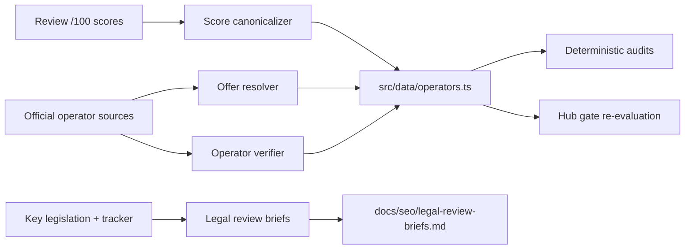

# SEO Conflict Resolution Design

**Date:** 2026-09-02
**Status:** Approved pending spec review
**Branch:** `cursor/seo-conflict-resolution-5d71`
**Base:** `main` (`2ca6051`)

## Goal

Resolve the human factual/legal review items carried forward from the SEO coherence program: 25 editor-score conflicts, four signup-offer conflicts, six tracker/site-policy differences plus the Card Crush policy intersection, 29 missing operator verification dates, and the two deferred commercial hubs. No factual value is guessed; every resolution is grounded in cited official source evidence or left explicitly unresolved with documented reason.

## Constraints (binding)

- No fabricated facts, scores, offers, payout times, legal conclusions, credentials, or social profiles.
- No mass redirects, URL changes, affiliate tracking changes, or canonical rewrites without explicit evidence.
- Tracker legal display, affiliate commercial availability, and site CTA policy remain three distinct authorities; no authority overwrites another.
- Content writing uses GLM 5.2 only; the agent captures official source URLs and dates and verifies GLM-drafted notes before canonicalizing.
- Every change ships with focused tests and small conventional commits; `npm run ci` must pass before push.
- Generated `src/pages/` is never authored; `reviews/*.html` and `src/routes/` remain the authored sources.

## Architecture

## Phase A — Canonicalize editor scores

### Scope
25 operators with unresolved `editorScore100` whose review `/100` and legacy `/5` disagree.

### Resolution rule
- Canonical `editorScore100` = the review page's visible `/100` value.
- Provenance: `source = reviews/<slug>.html`, `publishedOn` and `modifiedOn` from that review's `REVIEW_SOURCE_DATES` entry.
- Legacy `/5` ratings are removed from canonical rendering and schema. They remain only as conflict evidence in `docs/seo/operator-data-conflicts.md`, labeled `index.html#historical-homepage-snapshot-not-served` and `reviews/<slug>.html#review-jsonld`.
- The four already-verified scores (american-luck 72, legendz 84, playfame 86, roxymoxy 80) are unchanged.

### Files
- Modify: `src/data/operators.ts` — move 25 records from `unresolved` to `verified` with the `/100` value and review provenance.
- Modify: `docs/seo/operator-data-conflicts.md` — regenerate; 25 score rows become `RESOLVED` with cited resolution; four offer rows remain `UNRESOLVED`.
- Modify: `scripts/verify-operator-consistency.ts` and its tests — reject any remaining `/5`-as-editor-score leakage; assert all 29 `editorScore100` values are `verified` and on the 0–100 scale.
- Modify: `src/lib/operatorFactsHtml.ts` — verified scores render the canonical `/100`; no unresolved score state remains for these 25.
- Modify: `src/lib/homepage.ts` and `src/routes/index.astro` — the four verified scores remain supporting attributes; the 12-entry decision-support set is unchanged in selection rule but now all 29 scores are canonical.
- Regenerate: deterministic audits and sitemap `lastmod` for changed sources.

### Tests
- Red: 25 operators fail `operator:verify` with `unresolved` status; homepage/review renders show `unresolved` for the 25.
- Green: all 29 pass `operator:verify`; rendered reviews show the canonical `/100`; no `/5` value appears as an editor score in any rendered page or schema; `verify-schema-built` confirms `Review.reviewRating.ratingValue` equals the visible `/100` for all 29.

### Gate
All 29 `editorScore100` facts are `verified`; no `/5` value renders as an editor score; `npm run ci` passes.

## Phase B — Resolve four offer conflicts from official sources

### Scope
- crown-coins: `100,000 Crown Coins + 2 SC No Deposit` (historical homepage) vs `100,000 CC + 2 SC` (review).
- hello-millions: `7,500 GC + 2.5 SC Promo Code` (historical homepage) vs `15,000 GC + 2.5 SC` (review).
- spinblitz: `7,500 GC + 2.5 SC Promo Code` (historical homepage) vs `7,500 GC + 2.5 SC` (review).
- spree: `25,000 GC + 2.5 SC Instant Reg` (historical homepage) vs `25,000 GC + 2.5 SC` (review).

### Resolution rule
- For each operator, fetch the official promotion/terms page. GLM 5.2 drafts a capture note from the page text; the agent verifies the URL, the exact offer amount, and the capture date, then canonicalizes only when the official page unambiguously states the amount.
- Canonical `signupOffer` = the official-source value with provenance `source = <official URL>`, `verifiedOn = <capture date>`.
- If the official page is unavailable, conflicts with the official page, or states a different amount from a different official page, the field stays `unresolved` and the evidence gap is documented.
- The historical homepage snapshot and review values remain as conflict evidence only.

### Files
- Modify: `src/data/operators.ts` — set `signupOffer` to `verified` for resolved operators; keep `unresolved` with documented evidence gap for others.
- Modify: `src/routes/bonuses/no-deposit/index.astro` — render verified offers; keep unresolved cells omitted with `Details unavailable`.
- Modify: `docs/seo/operator-data-conflicts.md` — regenerate; resolved offer rows become `RESOLVED` with cited official URL and date.
- Regenerate audits.

### Tests
- Red: resolved operators fail `operator:verify` with `unresolved` offer; no-deposit hub renders `Details unavailable`.
- Green: resolved operators pass; no-deposit hub renders the verified offer; unresolved operators remain omitted; `verify-operator-consistency` asserts provenance URL and date for verified offers.

### Gate
Every resolved offer has an official-source URL and capture date; unresolved offers remain omitted; `npm run ci` passes.

## Phase C — Document state/legal-policy differences without changing CTA policy

### Scope
Six tracker/site-policy differences (CA, FL, IN, ME, MS, TN) plus the Card Crush commercial/site-policy intersection.

### Resolution rule
- Do not change `SITE_BANNED_STATES`, `src/data/affiliates.ts`, or tracker data.
- Draft a legal-review brief per state and for Card Crush with: tracker status, site CTA policy, enacted statute citations from `src/data/keyLegislation.ts`, and the precise policy question for counsel.
- File briefs at `docs/seo/legal-review-briefs.md`.
- Add a CI gate ensuring every recorded difference has a brief and failing if a new difference appears without one.

### Files
- Create: `docs/seo/legal-review-briefs.md`.
- Modify: `scripts/seo/audit-core.ts` and `scripts/seo/audit.test.ts` — assert every `state-legality-conflicts.md` warning row has a corresponding brief.
- Regenerate audits.

### Tests
- Red: a difference without a brief fails the audit test.
- Green: all seven differences have briefs; the gate passes.

### Gate
Every recorded tracker/site-policy difference and the Card-crush intersection has a brief; no CTA policy or legal status changed; `npm run ci` passes.

## Phase D — Operator verification dates

### Scope
All 29 operators.

### Resolution rule
- For each operator, check every decision-critical field (name, operator, launch date, signup offer, daily offer, cash/gift-card redemption minimum, published redemption timing, payment methods, game count) against official sources.
- Stamp `lastVerifiedDate` only when every available decision-critical field is verified against an official source; leave it `missing` with documented reason otherwise.
- GLM 5.2 drafts the verification note from official source text; the agent captures the URL and date and verifies the note before stamping.
- Fields that remain `unresolved` or `missing` after the pass keep their status; the verification date is not stamped until all available fields are verified.

### Files
- Modify: `src/data/operators.ts` — set `lastVerifiedDate` to `verified` with provenance for operators passing the full pass; keep `missing` for others.
- Modify: `docs/seo/operator-data-conflicts.md` and `docs/seo/implementation-report.md` — update resolved/remaining counts.
- Regenerate audits.

### Tests
- Red: operators without a complete verified field set fail the `lastVerifiedDate` assertion.
- Green: verified operators carry a `verifiedOn` date; incomplete operators remain `missing` with reason; `verify-operator-consistency` asserts the date is absent unless all available decision-critical fields are verified.

### Gate
`lastVerifiedDate` is `verified` only for operators with a complete available field set; all others remain `missing` with documented reason; `npm run ci` passes.

## Phase E — Re-evaluate deferred hubs

### Scope
"Fastest payout sweepstakes casinos" and "Most free Sweeps Coins".

### Resolution rule
- Re-run `evaluateCommercialHubCandidates` with the updated canonical data.
- Build a hub only if every approval gate passes (canonical field coverage, freshness, distinct intent, competing URLs, internal-link sources, conversion action).
- If gates still fail, keep the hub deferred and update `docs/seo/commercial-hub-plan.md` with the new evidence.
- Do not create filter permutations or thin routes.

### Files
- Modify: `docs/seo/commercial-hub-plan.md` — regenerate with updated gate results.
- Create: a hub route under `src/routes/` only if a candidate passes.
- Regenerate audits and sitemap.

### Tests
- Red: a candidate with a failing gate is not built; the gate test fails if the hub route exists without a passing gate.
- Green: passing candidates render with canonical data; failing candidates remain deferred with documented evidence.

### Gate
No hub is created unless every approval gate passes; deferred hubs have updated evidence; `npm run ci` passes.

## Phase F — Final QA and report

### Scope
Cumulative branch.

### Resolution rule
- Run `npm run ci`, rendered crawl, geo crawl, and spot-checks.
- Update `docs/seo/implementation-report.md` with resolved counts, remaining unresolved items, and human-review handoff.
- Confirm no factual value was invented; no URL, redirect, affiliate tracking, or legal conclusion changed without evidence.

### Files
- Modify: `docs/seo/implementation-report.md`.
- Create: `.superpowers/sdd/task-8-report.md` (execution report).

### Gate
Full CI passes; reports accurately state resolved and remaining counts; no invented facts.

## Open questions for human review

- Phase B: confirm official-source URLs and offer amounts with the operator before canonicalizing; the agent verifies the page text but cannot certify the operator's commercial intent.
- Phase C: counsel decides each tracker/site-policy difference; the briefs frame the question but do not answer it.
- Phase D: operators with no published official source for a field remain unresolved; the verification date is not stamped until all available fields are verified.
- Phase E: hub creation depends on Phase D outcomes; if no operator has a verification date, hubs remain deferred.
