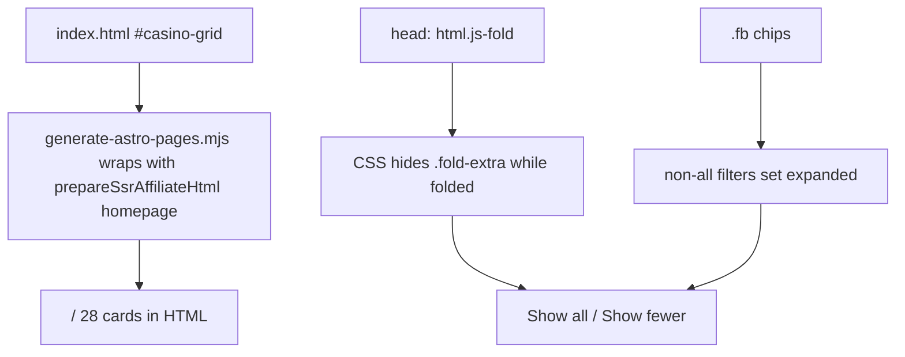

# Arcade Homepage 10-Card Fold Design

**Date:** 2026-09-03
**Status:** Approved
**Approved mockup:** original arcade cards with gold **Show all 28 casinos** / **Show fewer** (visual companion `fold-10-cards-original.html`)
**Base:** `main`

## Goal

Keep the live original arcade homepage (`index.html` on `/`) pixel-faithful, and fold the ranked grid so the first 10 cards show on load. The other 18 stay on the same page, in the same HTML, behind one gold button. This is a **fold**, not a new “top 10” ranking claim.

## Why this slice is separate

Homepage honesty (hero copy, rank badges, scores, offers, filters/schema, FAQ) still needs its own mockup-gated specs. This document covers **only** the fold. Do not change ranking chrome, scores, offers, hero text, or FAQ in this implementation.

## Constraints (binding)

- Do not restore `src/routes/index.astro`. `/` stays the generator-wrapped `index.html`.
- Do not edit generated `src/pages/`.
- Do not restyle cards, nav, hero, or Claim Bonus chrome. The only new chrome is the show-all control under the grid, using the existing `.btn-claim` gold treatment.
- All 28 ranked cards stay in the DOM in current source order. American Luck stays off this page.
- ItemList `#toplist` stays 28 items. Hidden cards still carry `data-item-position` / `data-item-name` / `data-item-url` so source-level ItemList parity keeps matching schema.
- Geo CTA suppression (`prepareSsrAffiliateHtml(..., 'homepage')`) still runs on every claim link. Folding must not skip or duplicate that pass.
- Showing 10 first must not add copy such as “Top 10,” “Best 10,” or a new ranked heading. Rank badges `#1`–`#28` stay as they are until a later honesty spec.
- No new marketing copy in this slice. Button labels are locked UI chrome from the approved mockup: **Show all 28 casinos** and **Show fewer**.
- No fabricated facts.

## Approved behavior

### Default (Complete List)

1. Cards 1–10 stay visible in current source order: McLuck, Pulsz, Crown Coins, Hello Millions, PlayFame, Casino Click, SpinBlitz, Legendz, Thrillzz, Card Crush.
2. Cards 11–28 stay in the grid markup (Spree through Mega Bonanza) but are not shown.
3. Under the grid, a gold `.btn-claim` button reads **Show all 28 casinos**. Helper text: `Showing 10 of 28. The other 18 stay on this page, just folded.`
4. Click expands all 28. The button becomes outlined **Show fewer** (transparent background, neon border — same as the approved mockup `.fold-fewer` treatment). Helper text: `Showing all 28. Click Show fewer to fold back to 10.`
5. **Show fewer** collapses back to the first 10.

### Filters

Existing filter chips still apply to all 28 cards.

- Any filter other than **Complete List** auto-expands so matches are not trapped behind the fold, then the existing tag filter hides non-matches.
- Switching back to **Complete List** re-collapses to 10 (unless the user immediately clicks Show all again).
- Filter logic stays in `index.html`; fold state is an extra class/flag, not a second grid or a jump to `/reviews/`.

### No-JS

If JavaScript does not run, all 28 cards stay visible and the show-all control stays hidden. The fold is progressive enhancement, not a content deletion.

## Architecture

### Units

1. **Markup** — `fold-extra` on articles 11–28; show-all wrapper immediately after `#casino-grid` and before `#how-we-rate`.
2. **CSS** — `style.css` fold rules only. No card layout changes.
3. **JS** — existing filter/FAQ/nav scripts stay. One fold IIFE in the same homepage script block: start folded when `js-fold` is present, toggle expanded, auto-expand on non-`all` filters, re-collapse on Complete List.
4. **Tests** — source assertions on 28 cards + fold markup; behavior test that default CSS-with-js hides extras; ItemList parity still 28.

### FOUC

A one-line script in `<head>` adds `js-fold` to `<html>` before the grid paints. CSS is exactly `.js-fold #casino-grid.fold-collapsed .fold-extra { display: none; }`. Do not put `hidden` on extras in the authored HTML, or no-JS and crawlers lose those cards.

Use a class on `#casino-grid` (`fold-collapsed` / no class when expanded) rather than `display:none !important` on every extra, so the existing filter `style.display` still wins for non-matching cards after auto-expand.

## Data flow

- No operator data, scores, or offers change.
- Fold state is client-only. No query param, hash, or localStorage.
- Schema JSON-LD in `index.html` is unchanged (`numberOfItems`: 28).
- Sitemap lastmod for `/` remains `['index.html']`.

## Error handling

- Missing `#fold-toggle` or fewer than 11 cards: fold script no-ops; all cards stay visible.
- Geo-blocked claim buttons (“Not available in your location”) must still appear on both the first 10 and the expanded 18. Folding is visibility only.
- `decorateChrome` / FAQ schema must keep working; do not wrap FAQ in fold markup.

## Testing

- Keep: `scripts/verify-homepage.test.ts` 28-card count, McLuck position 1, Mega Bonanza position 28, `#casino-grid` ItemList hooks, no `src/routes/index.astro`.
- Add: first 10 articles are not `fold-extra`; articles 11–28 are `fold-extra`; show-all button and helper text exist; head script adds `js-fold`; `style.css` hides extras only under `.js-fold` + collapsed grid.
- Add: a small DOM test (jsdom or the existing Node HTML parse pattern) that Complete List starts with 18 extras hidden, Show all reveals them, Show fewer hides them again, and `data-f="new2026"` removes the collapsed class before filtering.
- Keep: ItemList parity, FAQ chrome, geo crawl using `AFFILIATE_PARTNERS` + `availabilityForPartner` for `/`.
- `npm run ci` must pass.

## Files

- Modify: `index.html` — `fold-extra` on cards 11–28; fold button + helper after the grid; head `js-fold` script; fold IIFE next to the existing filter script.
- Modify: `style.css` — fold visibility and Show fewer outline only.
- Modify: `scripts/verify-homepage.test.ts` — fold markup and 28-card-in-DOM assertions.
- Add: focused fold behavior test beside the homepage verifier (same Node test style as the rest of the repo).
- Do not modify: `src/routes/`, generated `src/pages/`, `src/lib/homepage.ts` (still used by `/best/` and `/reviews/`), operator canonical data.

## Out of scope

- Hero live pill, H1, trust pills
- “Live & Verified” and section title claims
- Rank badges, Top Payout, Best overall, `#1`–`#28` honesty
- Score scale (`4.5 / 5` vs canonical `/100`)
- Card offers vs canonical facts
- Filter labels / ItemList ranking semantics
- Category “best” picks (`gq-best`) and FAQ/body ranking claims
- Crown Coins / SpinBlitz unresolved offers, legal briefs, verification dates, deferred hubs

Each of those gets its own mockup and spec later.

## Gate

The served `/` still looks like the original arcade page. On load with JS, 10 cards show and a gold **Show all 28 casinos** button sits under Card Crush. Expanding reveals the original remaining 18 cards. Schema and tests still see 28 operators. No new ranking claim is introduced.
